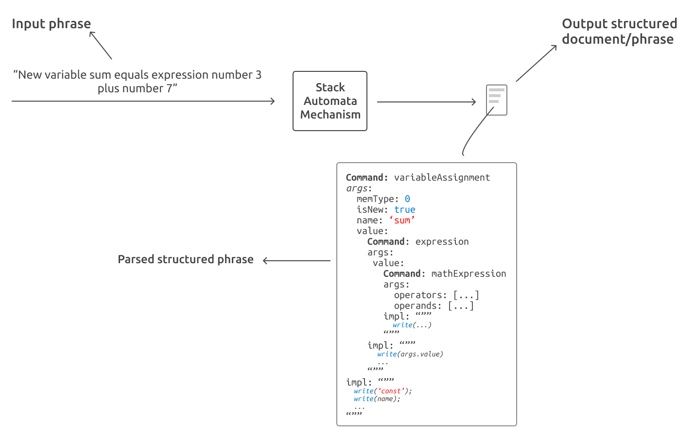

## Spoken

This module is capable of parsing english and portuguese phrases using a stack automata based mechanism. The phrases are parsed to commands, that can be executed later.

The diagram below illustrates how this module works:




### How to use it

You can learn how to use this module with the tests under [./src/__tests__](./src/__tests__).

The basic usage is as follows:

```javascript
import Spoken from 'spoken'

// command 'variableAssigment'
const result = Spoken.recognizePhrase('new constant doctorWho equals number 42', 'en-US')

// true
_.isEqal(result, {
    comand: 'variableAssigment',
    args: {
        memType: 0, // 0 == 'const', 1 == 'let'
        varName: 'doctorWho',
        value: {
            command: 'number',
            args: {
                value: 42
            }
            impl: "function(args, editor, common) {...}"
        }
    },
    impl: "function(args, editor, common){
        // something like: <args.memType> <args.varName> = <args.value>
        ...
    }"
})

```

### How to add new commands

A command is a folder with 2 archives: `impl.ts` (what will happen when this command gets executed) and a `phrase_en-US.dot` (an automata responsible for recognizing english phrases that will trigger this command).

An example of a simple command can be found in: [./src/modules/typescript/write](./src/modules/typescript/write)