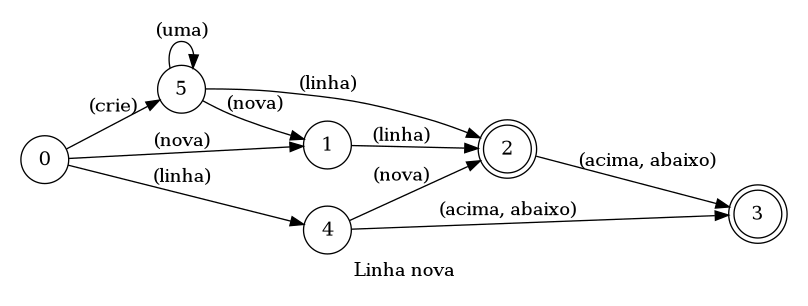
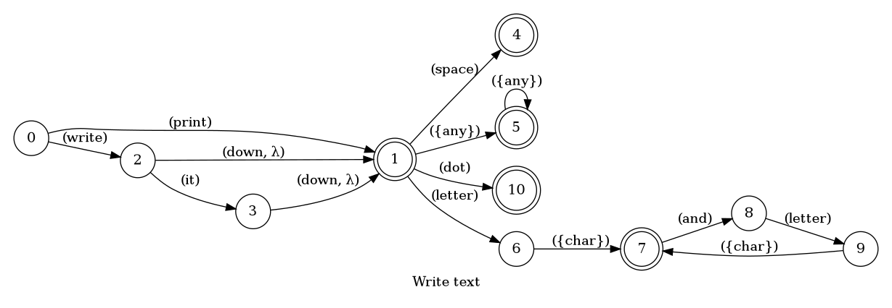

# Typescript voice commands

Collection of voice commands of the typescript language


---

## Move cursor

Moves the cursor to a different line or token

### Languages

This command is available in the following languages

**English**

The following automata is responsible for recognizing the command `Move cursor` in english:


The following are examples of phrases, in english, used to trigger the command `Move cursor`:

1. (cursor, pointer) (line) ({numeral})
2. (cursor, pointer) (symbol, letter) ({term})
3. (cursor, pointer) ({term}) (symbol, letter) ({term})
4. (cursor, pointer) (begin, end) (line)
5. (cursor, pointer) (next) (symbol)
6. (cursor, pointer) (next) ({numeral}) (symbol)

**Português**

O automata seguinte é reponsável por reconhecer o comando `Move cursor` em português:


As seguintes frases, em português, podem ser usadas para ativar o comando `Move cursor`:

1. (cursor, ponteiro) (linha) ({numeral})
2. (cursor, ponteiro) (símbolo, letra) ({term})
3. (cursor, ponteiro) ({term}) (símbolo, letra) ({term})
4. (cursor, ponteiro) (começo, final) (linha)
5. (cursor, ponteiro) (próximo) (símbolo, letra)
6. (cursor, ponteiro) (próximo) ({numeral}) (símbolo, letra)

### Implementation

Full implementation of this command can be found on this repository under the file [impl.ts](impl.ts)

```typescript
async function cursor(args: CursorParsedArgs, editor: Editor, context: {}) {
    console.log('[Spoken]: Executing: "cursor."')

    if (args.linePosition != null) {
        const pos = args.linePosition === LinePostionEnum.BEGIN ? 'BEGIN_LINE' : 'END_LINE'
        return await editor.moveCursor

(...)
```

---

## New constant or variable

Declares a new constant or variable in the current line

### Languages

This command is available in the following languages

**English**

The following automata is responsible for recognizing the command `New constant or variable` in english:


The following are examples of phrases, in english, used to trigger the command `New constant or variable`:

1. (declare, create) (constant, variable) (called) ({term})
2. (declare, create) (constant, variable) (called) ({term}) (with, λ) (value) ({term})
3. (declare, create) (constant, variable) (called) ({term}) (equals) ({term})
4. (declare, create) (constant, variable) (called) ({term}) (of, λ) (type) ({term}) (with, λ) (value) ({term})
5. (declare, create) (constant, variable) (called) ({term}) (of, λ) (type) ({term}) (equals) ({term})
6. (declare, create) (constant, variable) (called) ({term}) (of, λ) (type) ({term})

**Portugês**

O automata seguinte é reponsável por reconhecer o comando `New constant or variable` em português:


As seguintes frases, em português, podem ser usadas para ativar o comando `New constant or variable`:

1. (declare, crie) (uma) (constante, variável) (chamada) ({term})
2. (declare, crie) (constante, variável) (chamada) ({term})
3. (declare, crie) (uma) (constante, variável) (chamada) ({term}) (com) (o) (valor) ({term})
4. (declare, crie) (uma) (constante, variável) (chamada) ({term}) (com) (valor) ({term})
5. (declare, crie) (uma) (constante, variável) (chamada) ({term}) (o) (valor) ({term})
6. (declare, crie) (uma) (constante, variável) (chamada) ({term}) (valor) ({term})
7. (declare, crie) (uma) (constante, variável) (chamada) ({term}) (do) (tipo) ({term}) (com) (o) (valor) ({term})
8. (declare, crie) (uma) (constante, variável) (chamada) ({term}) (do) (tipo) ({term}) (com) (valor) ({term})
9. (declare, crie) (uma) (constante, variável) (chamada) ({term}) (do) (tipo) ({term}) (o) (valor) ({term})
10. (declare, crie) (uma) (constante, variável) (chamada) ({term}) (do) (tipo) ({term}) (valor) ({term})
11. (declare, crie) (uma) (constante, variável) (chamada) ({term}) (do) (tipo) ({term}) (igual) (a) ({term})
12. (declare, crie) (uma) (constante, variável) (chamada) ({term}) (do) (tipo) ({term}) (igual) ({term})
13. (declare, crie) (uma) (constante, variável) (chamada) ({term}) (tipo) ({term}) (com) (o) (valor) ({term})
14. (declare, crie) (uma) (constante, variável) (chamada) ({term}) (tipo) ({term}) (com) (valor) ({term})
15. (declare, crie) (uma) (constante, variável) (chamada) ({term}) (tipo) ({term}) (o) (valor) ({term})
16. (declare, crie) (uma) (constante, variável) (chamada) ({term}) (tipo) ({term}) (valor) ({term})

### Implementation

Full implementation of this command can be found on this repository under the file [impl.ts](impl.ts)

```typescript
async function DeclareVariable(command: ParsedDeclareVariable, editor: Editor, context: {}) {
    console.log('[Spoken]: Executing: "Declare a variable."')

    const memType = command.memType === MemType.constant ? 'const ' : 'let '
    const type = command.type ? `:${command.type}` : ''
    c

(...)
```

---

## Change line

Moves the cursor to a different line

### Languages

This command is available in the following languages

**English**

The following automata is responsible for recognizing the command `Change line` in english:


The following are examples of phrases, in english, used to trigger the command `Change line`:

1. (go) (to) (line) ({numeral})
2. (go) (line) ({numeral})
3. (line) ({numeral})

**Português**

O automata seguinte é reponsável por reconhecer o comando `Change line` em português:


As seguintes frases, em português, podem ser usadas para ativar o comando `Change line`:

1. (vá, vai) (para) (linha) ({numeral})
2. (vá, vai) (para) (a) (linha) ({numeral})
3. (vá, vai) (linha) ({numeral})
4. (linha) ({numeral})

### Implementation

Full implementation of this command can be found on this repository under the file [impl.ts](impl.ts)

```typescript
async function goToLine(command: GoToLineParsedArgs, editor: Editor, context: {}) {
    console.log('[Spoken]: Executing: "goToLine."')

    return await editor.goToLine(command.line as string)
}

type GoToLineParsedArgs = {
    line: number | string
} & ParsedPhrase

// @ts-ignore
return

(...)
```

---

## New line

Creates a new line above or below the current line

### Languages

This command is available in the following languages

**English**

The following automata is responsible for recognizing the command `New line` in english:


The following are examples of phrases, in english, used to trigger the command `New line`:

1. (new) (line)
2. (create) (new) (line)
3. (create) (line)
4. (new) (line) (above, below)
5. (line) (above, below)
6. (create) (new) (line) (above, below)
7. (create) (line) (above, below)

**Português**

O automata seguinte é reponsável por reconhecer o comando `New line` em português:



As seguintes frases, em português, podem ser usadas para ativar o comando `New line`:

1. (nova) (linha)
2. (linha) (nova)
3. (crie) (nova) (linha)
4. (crie) (linha)
5. (nova) (linha) (acima, abaixo)
6. (linha) (nova) (acima, abaixo)
7. (linha) (acima, abaixo)
8. (crie) (nova) (linha) (acima, abaixo)
9. (crie) (linha) (acima, abaixo)

### Implementation

Full implementation of this command can be found on this repository under the file [impl.ts](impl.ts)

```typescript
async function newLine(command: NewLineParsedArgs, editor: Editor, context: {}) {
    console.log('[Spoken]: Executing: "new line."')

    return await editor.newLine(command.position)
}

type NewLineParsedArgs = {
    position: PositionEnum
} & ParsedPhrase

// @ts-ignore
return newLine

(...)
```

---

## Write text

Write some text in the editor

### Languages

This command is available in the following languages

**English**

The following automata is responsible for recognizing the command `Write text` in english:



The following are examples of phrases, in english, used to trigger the command `Write text`:

1. (print) ({any})
2. (write) (down, λ) ({any})
3. (write) (it) (down, λ) ({any})

**Português**

O automata seguinte é reponsável por reconhecer o comando `Write text` em português:


As seguintes frases, em português, podem ser usadas para ativar o comando `Write text`:

1. (escreva) ({any})

### Implementation

Full implementation of this command can be found on this repository under the file [impl.ts](impl.ts)

```typescript
async function write(command: WriteParsedArgs, editor: Editor, context: {}) {
    console.log('[Spoken]: Executing: "write."')

    return await editor.write(command.text)
}

type WriteParsedArgs = {
    text: string
} & ParsedPhrase

// @ts-ignore
return write

(...)
```

---